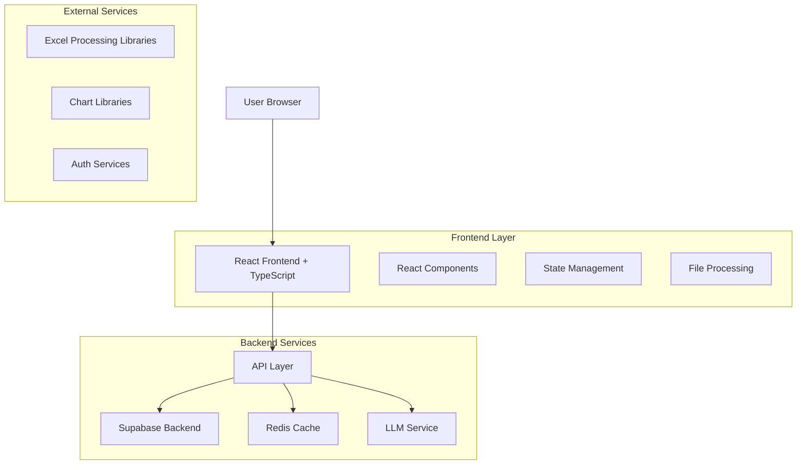
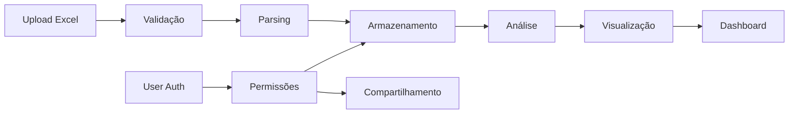
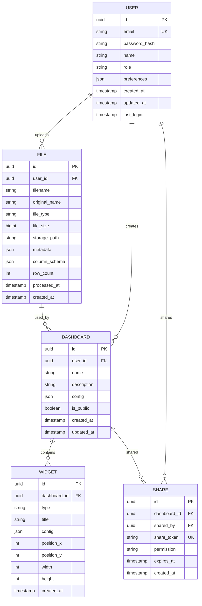

# Documentação Técnica - Leitor de Planilhas com Dashboard Inteligente

## 1. Visão Geral Técnica

### 1.1 Arquitetura do Sistema

O sistema é composto por uma arquitetura moderna de três camadas:



### 1.2 Tecnologias Principais

**Frontend:**
- React 18.2.0 com TypeScript 5.0
- Vite 4.4 como build tool
- Tailwind CSS 3.3 para estilização
- Zustand 4.4 para gerenciamento de estado
- React Query 4.32 para cache de dados
- React Hook Form 7.45 para formulários
- React Router 6.14 para navegação

**Processamento de Dados:**
- SheetJS (xlsx) 0.18.5 para leitura de Excel
- Papa Parse 5.4.1 para CSV
- Chart.js 4.3.0 para visualizações
- D3.js 7.8.5 para gráficos avançados
- Apache ECharts 5.4.3 para dashboards

**Backend e Infraestrutura:**
- Supabase para banco de dados PostgreSQL
- Supabase Auth para autenticação
- Supabase Storage para arquivos
- Redis para cache de consultas
- OpenAI API para análise inteligente

### 1.3 Estrutura de Dados e Fluxo de Informação



### 1.4 Segurança e Performance

**Segurança:**
- Autenticação JWT com refresh tokens
- CORS configurado para domínios específicos
- Rate limiting de 100 requests/minuto
- Validação de schema de dados
- Sanitização de inputs
- Criptografia de dados sensíveis

**Performance:**
- Lazy loading de componentes
- Virtualização para grandes datasets
- Cache de consultas com React Query
- Compressão de assets (gzip/brotli)
- CDN para assets estáticos
- Code splitting por rotas

## 2. Componentes e Módulos

### 2.1 Estrutura de Pastas

```
src/
├── components/
│   ├── common/
│   │   ├── Button/
│   │   ├── Input/
│   │   ├── Modal/
│   │   └── Loading/
│   ├── dashboard/
│   │   ├── ChartContainer/
│   │   ├── WidgetGrid/
│   │   └── DashboardLayout/
│   ├── file-upload/
│   │   ├── FileDropzone/
│   │   ├── FileList/
│   │   └── UploadProgress/
│   ├── data-table/
│   │   ├── DataTable/
│   │   ├── ColumnFilter/
│   │   └── Pagination/
│   └── visualization/
│       ├── ChartSelector/
│       ├── ChartRenderer/
│       └── CustomChart/
├── hooks/
│   ├── useAuth.ts
│   ├── useFileUpload.ts
│   ├── useDataAnalysis.ts
│   └── useChartConfig.ts
├── services/
│   ├── api/
│   │   ├── auth.service.ts
│   │   ├── file.service.ts
│   │   └── dashboard.service.ts
│   ├── processing/
│   │   ├── excel.processor.ts
│   │   ├── csv.processor.ts
│   │   └── data.validator.ts
│   └── storage/
│       ├── supabase.client.ts
│       └── cache.service.ts
├── store/
│   ├── auth.store.ts
│   ├── file.store.ts
│   └── dashboard.store.ts
├── types/
│   ├── user.types.ts
│   ├── file.types.ts
│   ├── chart.types.ts
│   └── api.types.ts
├── utils/
│   ├── constants.ts
│   ├── helpers.ts
│   └── validators.ts
└── pages/
    ├── Login/
    ├── Dashboard/
    ├── FileUpload/
    └── Settings/
```

### 2.2 Componentes React Principais

**Core Components:**
- `<App />`: Componente raiz com roteamento
- `<AuthProvider />`: Contexto de autenticação
- `<Layout />`: Estrutura base da aplicação
- `<PrivateRoute />`: Rota protegida

**File Processing:**
- `<FileUpload />`: Componente principal de upload
- `<FileDropzone />`: Área de arrastar arquivos
- `<FileProcessor />`: Processamento de dados
- `<DataPreview />`: Pré-visualização de dados

**Dashboard:**
- `<DashboardLayout />`: Layout do dashboard
- `<WidgetGrid />`: Grade de widgets
- `<ChartContainer />`: Container de gráficos
- `<ChartSelector />`: Seletor de tipos de gráfico
- `<CustomDashboard />`: Dashboard personalizável

**Data Visualization:**
- `<ChartRenderer />`: Renderizador genérico de gráficos
- `<DataTable />`: Tabela de dados com filtros
- `<PivotTable />`: Tabela dinâmica
- `<ExportButton />`: Botão de exportação

### 2.3 APIs e Serviços

**Auth Service:**
```typescript
interface AuthService {
  login(email: string, password: string): Promise<User>
  logout(): Promise<void>
  register(userData: RegisterData): Promise<User>
  refreshToken(): Promise<string>
  getCurrentUser(): User | null
}
```

**File Service:**
```typescript
interface FileService {
  uploadFile(file: File): Promise<FileUpload>
  processFile(fileId: string): Promise<ProcessedData>
  getFile(fileId: string): Promise<FileData>
  deleteFile(fileId: string): Promise<void>
  listFiles(userId: string): Promise<FileList>
}
```

**Dashboard Service:**
```typescript
interface DashboardService {
  createDashboard(config: DashboardConfig): Promise<Dashboard>
  getDashboard(dashboardId: string): Promise<Dashboard>
  updateDashboard(dashboardId: string, config: DashboardConfig): Promise<Dashboard>
  deleteDashboard(dashboardId: string): Promise<void>
  shareDashboard(dashboardId: string, shareConfig: ShareConfig): Promise<string>
}
```

## 3. Banco de Dados e Modelagem

### 3.1 Esquema de Dados



### 3.2 DDL - Data Definition Language

```sql
-- Tabela de Usuários
CREATE TABLE users (
    id UUID PRIMARY KEY DEFAULT gen_random_uuid(),
    email VARCHAR(255) UNIQUE NOT NULL,
    password_hash VARCHAR(255) NOT NULL,
    name VARCHAR(100) NOT NULL,
    role VARCHAR(20) DEFAULT 'user' CHECK (role IN ('user', 'admin')),
    preferences JSONB DEFAULT '{}',
    created_at TIMESTAMP WITH TIME ZONE DEFAULT NOW(),
    updated_at TIMESTAMP WITH TIME ZONE DEFAULT NOW(),
    last_login TIMESTAMP WITH TIME ZONE
);

-- Tabela de Arquivos
CREATE TABLE files (
    id UUID PRIMARY KEY DEFAULT gen_random_uuid(),
    user_id UUID REFERENCES users(id) ON DELETE CASCADE,
    filename VARCHAR(255) NOT NULL,
    original_name VARCHAR(255) NOT NULL,
    file_type VARCHAR(50) NOT NULL,
    file_size BIGINT NOT NULL,
    storage_path TEXT NOT NULL,
    metadata JSONB DEFAULT '{}',
    column_schema JSONB DEFAULT '[]',
    row_count INTEGER DEFAULT 0,
    processed_at TIMESTAMP WITH TIME ZONE,
    created_at TIMESTAMP WITH TIME ZONE DEFAULT NOW()
);

-- Tabela de Dashboards
CREATE TABLE dashboards (
    id UUID PRIMARY KEY DEFAULT gen_random_uuid(),
    user_id UUID REFERENCES users(id) ON DELETE CASCADE,
    name VARCHAR(255) NOT NULL,
    description TEXT,
    config JSONB DEFAULT '{}',
    is_public BOOLEAN DEFAULT FALSE,
    created_at TIMESTAMP WITH TIME ZONE DEFAULT NOW(),
    updated_at TIMESTAMP WITH TIME ZONE DEFAULT NOW()
);

-- Tabela de Widgets
CREATE TABLE widgets (
    id UUID PRIMARY KEY DEFAULT gen_random_uuid(),
    dashboard_id UUID REFERENCES dashboards(id) ON DELETE CASCADE,
    type VARCHAR(50) NOT NULL,
    title VARCHAR(255) NOT NULL,
    config JSONB DEFAULT '{}',
    position_x INTEGER DEFAULT 0,
    position_y INTEGER DEFAULT 0,
    width INTEGER DEFAULT 4,
    height INTEGER DEFAULT 4,
    created_at TIMESTAMP WITH TIME ZONE DEFAULT NOW()
);

-- Tabela de Compartilhamento
CREATE TABLE shares (
    id UUID PRIMARY KEY DEFAULT gen_random_uuid(),
    dashboard_id UUID REFERENCES dashboards(id) ON DELETE CASCADE,
    shared_by UUID REFERENCES users(id),
    share_token VARCHAR(255) UNIQUE NOT NULL,
    permission VARCHAR(20) DEFAULT 'view' CHECK (permission IN ('view', 'edit')),
    expires_at TIMESTAMP WITH TIME ZONE,
    created_at TIMESTAMP WITH TIME ZONE DEFAULT NOW()
);

-- Índices para performance
CREATE INDEX idx_files_user_id ON files(user_id);
CREATE INDEX idx_files_created_at ON files(created_at DESC);
CREATE INDEX idx_dashboards_user_id ON dashboards(user_id);
CREATE INDEX idx_widgets_dashboard_id ON widgets(dashboard_id);
CREATE INDEX idx_shares_dashboard_id ON shares(dashboard_id);
CREATE INDEX idx_shares_token ON shares(share_token);

-- Permissões Supabase
GRANT SELECT ON users TO anon;
GRANT ALL PRIVILEGES ON users TO authenticated;
GRANT SELECT ON files TO anon;
GRANT ALL PRIVILEGES ON files TO authenticated;
GRANT SELECT ON dashboards TO anon;
GRANT ALL PRIVILEGES ON dashboards TO authenticated;
GRANT SELECT ON widgets TO anon;
GRANT ALL PRIVILEGES ON widgets TO authenticated;
GRANT SELECT ON shares TO anon;
GRANT ALL PRIVILEGES ON shares TO authenticated;
```

## 4. Funcionalidades Técnicas

### 4.1 Processamento de Arquivos Excel

**Leitura e Parsing:**
```typescript
class ExcelProcessor {
  async processFile(file: File): Promise<ProcessedData> {
    const workbook = XLSX.read(await file.arrayBuffer());
    const sheets = this.extractSheets(workbook);
    const data = this.normalizeData(sheets);
    const schema = this.inferSchema(data);
    
    return {
      sheets,
      data,
      schema,
      statistics: this.calculateStats(data)
    };
  }
  
  private extractSheets(workbook: XLSX.WorkBook): SheetData[] {
    return workbook.SheetNames.map(name => ({
      name,
      data: XLSX.utils.sheet_to_json(workbook.Sheets[name])
    }));
  }
}
```

**Validação de Dados:**
- Validação de tipos de coluna
- Detecção de valores nulos
- Identificação de outliers
- Validação de formato de data
- Limite de 1 milhão de linhas por planilha

### 4.2 Algoritmos de Análise de Dados

**Análise Estatística:**
```typescript
class DataAnalyzer {
  calculateStatistics(data: any[]): DataStats {
    return {
      count: data.length,
      mean: this.calculateMean(data),
      median: this.calculateMedian(data),
      mode: this.calculateMode(data),
      standardDeviation: this.calculateStdDev(data),
      variance: this.calculateVariance(data),
      min: Math.min(...data),
      max: Math.max(...data),
      quartiles: this.calculateQuartiles(data)
    };
  }
  
  detectOutliers(data: number[]): Outlier[] {
    const q1 = this.calculateQuartile(data, 0.25);
    const q3 = this.calculateQuartile(data, 0.75);
    const iqr = q3 - q1;
    const lowerBound = q1 - 1.5 * iqr;
    const upperBound = q3 + 1.5 * iqr;
    
    return data
      .map((value, index) => ({ value, index }))
      .filter(({ value }) => value < lowerBound || value > upperBound);
  }
}
```

**Análise com IA:**
- Sugestões automáticas de visualizações
- Detecção de padrões e tendências
- Geração de insights automáticos
- Recomendações de filtros

### 4.3 Geração de Visualizações

**Chart Configuration:**
```typescript
interface ChartConfig {
  type: 'line' | 'bar' | 'pie' | 'scatter' | 'heatmap' | 'treemap';
  data: ChartData;
  options: ChartOptions;
  responsive: boolean;
  animation: boolean;
}

class ChartGenerator {
  generateChart(config: ChartConfig): Chart {
    const chartType = this.resolveChartType(config.type);
    const processedData = this.processDataForChart(config.data);
    
    return new Chart(chartType, {
      data: processedData,
      options: this.buildOptions(config.options)
    });
  }
}
```

**Tipos de Visualizações Suportadas:**
- Gráficos de linha e área
- Gráficos de barras e colunas
- Gráficos de pizza e donut
- Gráficos de dispersão
- Mapas de calor
- Gráficos de árvore
- Tabelas dinâmicas
- KPI cards

### 4.4 Sistema de Autenticação e Autorização

**JWT Token Management:**
```typescript
class AuthManager {
  private token: string | null = null;
  private refreshToken: string | null = null;
  
  async login(credentials: LoginCredentials): Promise<AuthResult> {
    const response = await this.supabase.auth.signInWithPassword(credentials);
    this.token = response.data.session?.access_token;
    this.refreshToken = response.data.session?.refresh_token;
    
    return {
      user: response.data.user,
      token: this.token,
      expiresAt: response.data.session?.expires_at
    };
  }
  
  async refresh(): Promise<string> {
    const response = await this.supabase.auth.refreshSession({
      refresh_token: this.refreshToken!
    });
    
    this.token = response.data.session?.access_token;
    return this.token!;
  }
}
```

**Role-Based Access Control (RBAC):**
- Usuário comum: upload, visualização, criação de dashboards
- Administrador: todas as funcionalidades + gestão de usuários
- Sistema de permissões granular por dashboard

## 5. Requisitos Não-Funcionais

### 5.1 Performance e Escalabilidade

**Métricas de Performance:**
- Tempo de carregamento inicial: < 3 segundos
- Tempo de processamento de arquivo (1MB): < 5 segundos
- Tempo de renderização de gráfico: < 1 segundo
- Suporte para até 1000 usuários simultâneos
- Capacidade de processar arquivos até 100MB

**Otimizações:**
- Paginação de dados (100 linhas por página)
- Virtualização para tabelas grandes
- Lazy loading de componentes
- Cache de consultas frequentes
- Compressão de respostas da API

### 5.2 Segurança e Privacidade

**Medidas de Segurança:**
- Criptografia de dados em repouso (AES-256)
- HTTPS obrigatório para todas as comunicações
- Rate limiting por IP e usuário
- Validação de inputs contra XSS e SQL Injection
- Logs de auditoria para ações críticas
- Conformidade com LGPD/GDPR

**Controle de Acesso:**
- Autenticação de dois fatores (2FA)
- Sessões com timeout automático
- Tokens com expiração configurável
- Revogação imediata de tokens comprometidos

### 5.3 Acessibilidade (WCAG 2.1 AA)

**Requisitos de Acessibilidade:**
- Navegação completa por teclado
- Suporte a leitores de tela (ARIA labels)
- Contraste mínimo de 4.5:1 para texto
- Tamanho de fonte mínimo de 16px
- Alternativas textuais para gráficos
- Estrutura semântica de HTML

**Implementações:**
```typescript
// Exemplo de componente acessível
const AccessibleChart = ({ data, title }: ChartProps) => {
  return (
    <div role="img" aria-label={`Gráfico de ${title}`}>
      <Chart data={data} />
      <div className="sr-only">
        <h3>Dados do gráfico {title}</h3>
        <ul>
          {data.map((point, index) => (
            <li key={index}>
              {point.label}: {point.value}
            </li>
          ))}
        </ul>
      </div>
    </div>
  );
};
```

### 5.4 Responsividade

**Breakpoints:**
- Mobile: 320px - 767px
- Tablet: 768px - 1023px
- Desktop: 1024px - 1439px
- Large Desktop: 1440px+

**Adaptações:**
- Layout de dashboard em grid responsivo
- Gráficos adaptativos
- Menu hambúrguer em mobile
- Tabelas com scroll horizontal
- Touch-friendly para dispositivos móveis

## 6. Guia de Instalação e Configuração

### 6.1 Pré-requisitos

**Sistema:**
- Node.js 18.0 ou superior
- npm 9.0 ou yarn 1.22
- Git 2.30 ou superior

**Dependências Externas:**
- Conta Supabase ativa
- Redis (opcional, para cache)
- OpenAI API key (opcional, para análise IA)

### 6.2 Passos de Instalação

```bash
# 1. Clone o repositório
git clone https://github.com/seu-usuario/leitor-planilhas-dashboard.git
cd leitor-planilhas-dashboard

# 2. Instale as dependências
npm install
# ou
yarn install

# 3. Configure as variáveis de ambiente
cp .env.example .env.local

# 4. Edite o arquivo .env.local com suas configurações
VITE_SUPABASE_URL=sua-url-do-supabase
VITE_SUPABASE_ANON_KEY=sua-chave-anon-do-supabase
VITE_OPENAI_API_KEY=sua-chave-openai
VITE_REDIS_URL=sua-url-redis

# 5. Execute o servidor de desenvolvimento
npm run dev
# ou
yarn dev
```

### 6.3 Configuração de Ambiente

**Variáveis de Ambiente Obrigatórias:**
```env
# Supabase
VITE_SUPABASE_URL=https://sua-instancia.supabase.co
VITE_SUPABASE_ANON_KEY=sua-chave-anon

# Aplicação
VITE_APP_NAME="Leitor de Planilhas Inteligente"
VITE_APP_URL=http://localhost:5173
VITE_API_URL=http://localhost:3000/api

# Performance
VITE_MAX_FILE_SIZE=104857600  # 100MB em bytes
VITE_MAX_ROWS=1000000
VITE_CACHE_TTL=3600
```

**Variáveis Opcionais:**
```env
# OpenAI (para análise inteligente)
VITE_OPENAI_API_KEY=sk-sua-chave-openai
VITE_OPENAI_MODEL=gpt-4

# Redis (para cache)
VITE_REDIS_URL=redis://localhost:6379
VITE_REDIS_TTL=7200

# Analytics
VITE_GA_TRACKING_ID=GA-XXXXXXXXX
VITE_SENTRY_DSN=https://sentry.io/...
```

### 6.4 Deploy

**Deploy com Vercel:**
```bash
# 1. Instale a CLI do Vercel
npm i -g vercel

# 2. Faça login
vercel login

# 3. Deploy
vercel --prod
```

**Deploy com Docker:**
```dockerfile
# Dockerfile
FROM node:18-alpine AS builder
WORKDIR /app
COPY package*.json ./
RUN npm ci --only=production

FROM node:18-alpine
WORKDIR /app
COPY --from=builder /app/node_modules ./node_modules
COPY . .
RUN npm run build

EXPOSE 5173
CMD ["npm", "run", "preview"]
```

```yaml
# docker-compose.yml
version: '3.8'
services:
  app:
    build: .
    ports:
      - "5173:5173"
    environment:
      - VITE_SUPABASE_URL=${VITE_SUPABASE_URL}
      - VITE_SUPABASE_ANON_KEY=${VITE_SUPABASE_ANON_KEY}
    depends_on:
      - redis
  
  redis:
    image: redis:7-alpine
    ports:
      - "6379:6379"
```

**Configuração de CI/CD:**
```yaml
# .github/workflows/deploy.yml
name: Deploy to Production

on:
  push:
    branches: [main]

jobs:
  deploy:
    runs-on: ubuntu-latest
    steps:
      - uses: actions/checkout@v3
      
      - name: Setup Node.js
        uses: actions/setup-node@v3
        with:
          node-version: '18'
          cache: 'npm'
      
      - name: Install dependencies
        run: npm ci
      
      - name: Run tests
        run: npm run test:ci
      
      - name: Build
        run: npm run build
      
      - name: Deploy to Vercel
        run: vercel --prod --token=${{ secrets.VERCEL_TOKEN }}
```

## 7. Monitoramento e Manutenção

### 7.1 Logs e Monitoramento

**Estrutura de Logs:**
```typescript
class Logger {
  static log(level: 'info' | 'warn' | 'error', message: string, meta?: any) {
    const logEntry = {
      timestamp: new Date().toISOString(),
      level,
      message,
      meta,
      userId: getCurrentUserId(),
      sessionId: getSessionId()
    };
    
    console.log(JSON.stringify(logEntry));
    // Enviar para serviço de logging externo
  }
}
```

**Métricas de Monitoramento:**
- Tempo de resposta da API
- Taxa de erro por endpoint
- Tempo de processamento de arquivos
- Número de usuários ativos
- Uso de memória e CPU

### 7.2 Manutenção Preventiva

**Tarefas Semanais:**
- Verificar logs de erro
- Atualizar dependências de segurança
- Limpar cache expirado
- Backup do banco de dados

**Tarefas Mensais:**
- Análise de performance
- Auditoria de segurança
- Atualização de documentação
- Revisão de custos de infraestrutura

## 8. Troubleshooting

### 8.1 Problemas Comuns

**Erro ao processar arquivo grande:**
- Verificar limite de tamanho no Nginx
- Aumentar timeout da API
- Implementar processamento em chunks

**Problemas de CORS:**
- Verificar configuração do Supabase
- Adicionar domínios permitidos
- Verificar headers de requisição

**Performance lenta:**
- Verificar índices do banco de dados
- Implementar paginação
- Otimizar queries
- Usar cache adequadamente

### 8.2 Debug e Diagnóstico

```typescript
// Debug mode
const DEBUG = import.meta.env.VITE_DEBUG === 'true';

if (DEBUG) {
  console.group('Debug Info');
  console.log('User:', getCurrentUser());
  console.log('State:', getAppState());
  console.log('Performance:', performance.now());
  console.groupEnd();
}
```

---

**Documentação gerada em:** 15 de novembro de 2025
**Versão:** 1.0.0
**Última atualização:** 15 de novembro de 2025