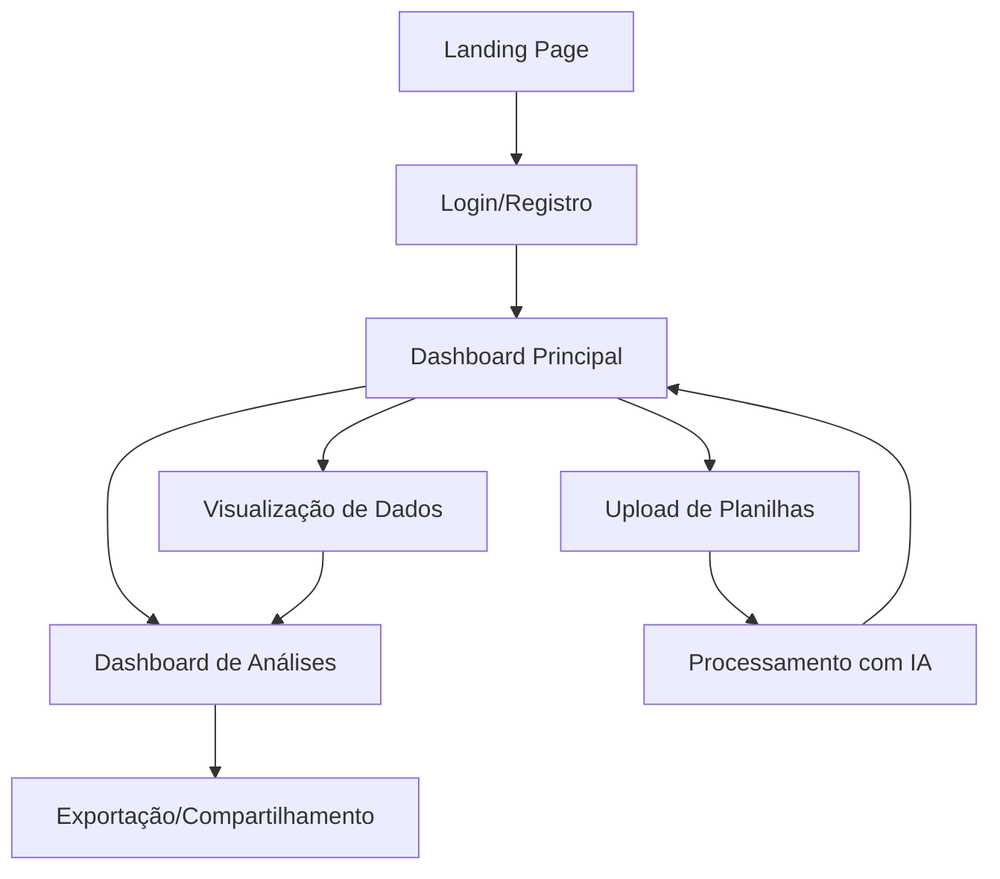

## 1. Visão Geral do Produto

O Leitor de Planilhas com Dashboard Inteligente é uma aplicação full-stack que permite aos usuários fazer upload de planilhas Excel/CSV, processar os dados automaticamente e visualizar insights através de dashboards interativos com análises de IA. O sistema resolve o problema de análise manual de grandes volumes de dados em planilhas, automatizando a extração de insights valiosos.

O produto é direcionado para profissionais de negócios, analistas de dados e pequenas empresas que precisam transformar dados brutos em informações acionáveis sem conhecimento técnico avançado. O diferencial competitivo está na integração de IA para geração automática de análises e recomendações personalizadas.

## 2. Funcionalidades Principais

### 2.1 Papéis de Usuário

| Papel | Método de Registro | Permissões Principais |
|-------|-------------------|----------------------|
| Usuário Gratuito | Registro por email | Upload de até 10 planilhas/mês, dashboards básicos |
| Usuário Premium | Upgrade via pagamento | Upload ilimitado, dashboards avançados, IA personalizada |
| Administrador | Designado internamente | Gestão de usuários, monitoramento do sistema |

### 2.2 Módulos de Funcionalidades

O sistema consiste nas seguintes páginas principais:

1. **Landing Page**: Apresentação do produto, captura de leads, demonstração de funcionalidades
2. **Dashboard Principal**: Visão geral das planilhas processadas, cards de métricas, acesso rápido às funcionalidades
3. **Upload de Planilhas**: Interface drag-and-drop, preview dos dados, configuração de processamento
4. **Visualização de Dados**: Tabelas interativas, filtros dinâmicos, ordenação e pesquisa
5. **Dashboard de Análises**: Gráficos interativos, KPIs automáticos, análises de IA
6. **Configurações de Conta**: Perfil do usuário, preferências, histórico de uploads
7. **Página de Login/Registro**: Autenticação segura, recuperação de senha, onboarding

### 2.3 Detalhes das Páginas

| Nome da Página | Módulo | Descrição das Funcionalidades |
|----------------|---------|------------------------------|
| Landing Page | Hero Section | Apresentação com animação de elementos de dashboard, call-to-action principal, demonstração de casos de uso |
| Landing Page | Seção de Recursos | Cards interativos mostrando principais funcionalidades, ícones animados, descrições concisas |
| Landing Page | Seção de Preços | Tabela comparativa de planos, destaque para plano premium, FAQ interativo |
| Dashboard Principal | Cards de Métricas | Exibição de total de uploads, planilhas processadas, espaço utilizado, última atividade |
| Dashboard Principal | Lista de Planilhas | Tabela com nome, data de upload, status de processamento, ações rápidas (visualizar, excluir) |
| Dashboard Principal | Gráficos Rápidos | Visualizações miniatura dos principais insights, atualização em tempo real |
| Upload de Planilhas | Drag-and-Drop | Área de upload com suporte para arrastar arquivos, validação de formato, barra de progresso |
| Upload de Planilhas | Preview de Dados | Visualização das primeiras 10 linhas, detecção automática de tipos de dados, mapeamento de colunas |
| Upload de Planilhas | Configuração de Processamento | Opções de limpeza de dados, seleção de colunas para análise, configuração de IA |
| Visualização de Dados | Tabela Interativa | Paginação, ordenação por colunas, pesquisa global, filtros por tipo de dado |
| Visualização de Dados | Edição de Células | Edição inline, validação de dados, histórico de alterações, salvamento automático |
| Visualização de Dados | Exportação | Download em diferentes formatos (Excel, CSV, PDF), seleção de colunas para exportação |
| Dashboard de Análises | Gráficos Interativos | Gráficos de barras, linhas, pizza, dispersão, com zoom e filtros dinâmicos |
| Dashboard de Análises | KPIs Automáticos | Cálculo automático de médias, tendências, correlações, outliers detectados |
| Dashboard de Análises | Insights de IA | Recomendações personalizadas, previsões baseadas em dados, alertas automáticos |
| Configurações de Conta | Perfil do Usuário | Edição de informações pessoais, foto de perfil, preferências de notificação |
| Configurações de Conta | Histórico de Uploads | Lista completa com paginação, reprocessamento de arquivos, estatísticas de uso |
| Login/Registro | Autenticação | Login com email/senha, OAuth (Google), validação de força de senha, captcha |
| Login/Registro | Recuperação de Senha | Processo de recuperação por email, token de segurança, redefinição segura |

## 3. Processos Principais

### Fluxo de Upload e Processamento
1. Usuário acessa página de upload via dashboard
2. Arrasta ou seleciona arquivo Excel/CSV (máximo 50MB)
3. Sistema valida formato e estrutura dos dados
4. Preview dos dados é exibido para confirmação
5. Usuário configura opções de processamento
6. Sistema processa planilha e gera análises com IA
7. Dashboard é atualizado com novos dados e insights

### Fluxo de Análise e Visualização
1. Usuário seleciona planilha processada no dashboard
2. Visualiza dados em tabela interativa com filtros
3. Acessa dashboard de análises com gráficos gerados automaticamente
4. Explora insights de IA e recomendações personalizadas
5. Exporta visualizações ou compartilha via link temporário

## 4. Design de Interface

### 4.1 Estilo de Design

**Cores Principais:**
- Primária: #2563EB (Azul profissional)
- Secundária: #10B981 (Verde sucesso)
- Apoio: #F59E0B (Laranja destaque)
- Background: #F9FAFB (Cinza claro)
- Texto: #1F2937 (Cinza escuro)

**Elementos de UI:**
- Botões: Estilo arredondado com sombra suave, efeito hover com transição
- Tipografia: Inter para headings, Roboto para body text
- Layout: Card-based com grid responsivo, navegação lateral fixa
- Ícones: Estilo line-icons minimalista, animações sutis
- Animações: Transições de página suaves, loading skeletons, micro-interações

### 4.2 Visão Geral das Páginas

| Nome da Página | Módulo | Elementos de UI |
|----------------|---------|----------------|
| Landing Page | Hero Section | Background gradient animado, heading grande (48px), CTA button destacado, mockup de dashboard flutuante |
| Landing Page | Recursos | Cards com ícones 3D, hover effects com scale, descrições com 2 linhas máximo |
| Dashboard Principal | Métricas | Cards coloridos com ícones, números grandes (32px), variação percentual em verde/vermelho |
| Dashboard Principal | Tabela | Linhas zebradas, hover highlight, actions menu dropdown, status badges coloridos |
| Upload de Planilhas | Área de Upload | Dropzone com borda tracejada, ícone de nuvem grande, texto de instrução claro |
| Visualização de Dados | Tabela | Header fixo, scroll vertical, pagination bottom, search bar top com ícone |
| Dashboard de Análises | Gráficos | Chart.js com temas customizados, legendas interativas, tooltips detalhados |

### 4.3 Responsividade

- **Mobile-first approach**: Design otimizado para telas pequenas
- **Breakpoints**: 640px, 768px, 1024px, 1280px
- **Touch optimization**: Botões mínimos 44px, gestos de swipe em tabelas
- **Performance mobile**: Lighthouse score mínimo 90, lazy loading de imagens
- **Adaptação de componentes**: Menu hamburger, tabelas horizontal scroll, cards empilhados

## 5. Requisitos de Qualidade

### Performance
- Tempo de carregamento inicial < 3 segundos
- Upload de arquivos 50MB em < 30 segundos
- Processamento de IA em < 2 minutos para 10k linhas
- Lighthouse score mínimo: Performance 90, Acessibilidade 95, SEO 90

### Segurança
- Criptografia de dados em repouso e em trânsito
- Rate limiting de 100 requests/minuto por usuário
- Validação de arquivos contra malware
- JWT com expiração de 24h, refresh tokens de 7 dias

### Compatibilidade
- Navegadores: Chrome 90+, Firefox 88+, Safari 14+, Edge 90+
- Resoluções mínimas: 320px largura, 568px altura
- Conexão: Funcional em 3G, otimizado para 4G+

### Testes
- Cobertura de testes mínima 80% (frontend e backend)
- Testes E2E para fluxos críticos de usuário
- Testes de performance com 1000 usuários simultâneos
- Testes de segurança OWASP Top 10

## 6. Integrações e APIs Externas

### IA e Machine Learning
- OpenAI GPT-4 para geração de insights e recomendações
- Análise de dados com algoritmos próprios de estatística
- Detecção de padrões e anomalias em dados

### Serviços de Terceiros
- Supabase para autenticação, banco de dados e storage
- Stripe para processamento de pagamentos (plano premium)
- SendGrid para emails transacionais e marketing
- Google OAuth para login social

### APIs Internas
- RESTful API com autenticação JWT
- WebSocket para atualizações em tempo real
- Webhooks para integrações externas