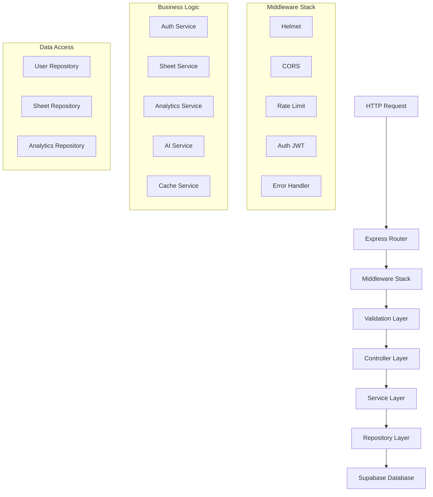
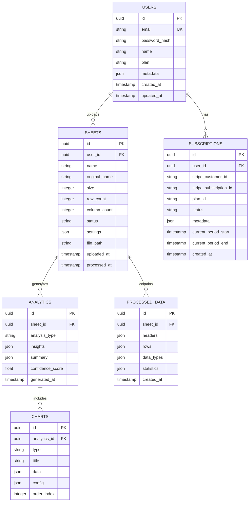

## 1. Arquitetura do Sistema

```mermaid
graph TD
    A[User Browser] --> B[React Frontend]
    B --> C[Express.js Backend API]
    C --> D[Supabase Database]
    C --> E[Supabase Auth]
    C --> F[Supabase Storage]
    C --> G[OpenAI API]
    C --> H[Redis Cache]
    
    subgraph "Frontend Layer"
        B[B[React 18 + TypeScript + Vite]]
        I[Chart.js]
        J[Tailwind CSS]
        K[React Query]
    end
    
    subgraph "Backend Layer"
        C[Express.js + TypeScript]
        L[JWT Middleware]
        M[Multer Upload]
        N[Data Processing Service]
        O[AI Service]
    end
    
    subgraph "Data & Services Layer"
        D[(PostgreSQL)]
        E[Auth Service]
        F[Object Storage]
        G[AI Platform]
        H[(Redis)]
    end
```

## 2. Descrição das Tecnologias

### Frontend Stack
- **React 18**: Framework principal com hooks e concurrent features
- **TypeScript 5**: Type safety e melhor desenvolvimento
- **Vite 5**: Build tool rápido com HMR instantâneo
- **Tailwind CSS 3**: Estilização utilitária e responsiva
- **React Query**: Gerenciamento de estado servidor
- **React Hook Form**: Formulários performáticos
- **Chart.js**: Visualização de dados interativos
- **React Router 6**: Roteamento client-side
- **Axios**: Cliente HTTP para APIs
- **React Dropzone**: Upload de arquivos drag-and-drop

### Backend Stack
- **Express.js 4**: Framework web minimalista
- **TypeScript 5**: Type safety no backend
- **Supabase SDK**: Integração com serviços Supabase
- **Multer**: Processamento de multipart/form-data
- **JWT**: Autenticação stateless
- **Bcrypt**: Hashing de senhas
- **Zod**: Validação de schemas
- **Winston**: Logging estruturado
- **Helmet**: Segurança de headers HTTP
- **CORS**: Cross-origin resource sharing
- **Express Rate Limit**: Rate limiting por IP/usuário
- **XLSX**: Parsing de arquivos Excel
- **Papaparse**: Parsing de arquivos CSV
- **Node-cache**: Cache em memória para performance

### Infraestrutura e Serviços
- **Supabase**: Backend-as-a-service completo
- **PostgreSQL**: Banco de dados relacional
- **Redis**: Cache distribuído para performance
- **OpenAI API**: Processamento de IA e geração de insights
- **Stripe**: Processamento de pagamentos
- **SendGrid**: Envio de emails transacionais
- **Docker**: Containerização da aplicação
- **Nginx**: Reverse proxy e load balancing

## 3. Definições de Rotas

### Frontend Routes (React Router)

| Rota | Componente | Props | Descrição |
|------|------------|-------|-----------|
| `/` | LandingPage | - | Página inicial com apresentação do produto |
| `/login` | LoginPage | - | Página de autenticação de usuários |
| `/register` | RegisterPage | - | Página de registro de novos usuários |
| `/dashboard` | Dashboard | - | Dashboard principal com métricas e navegação |
| `/upload` | UploadPage | - | Interface de upload de planilhas |
| `/sheets/:id` | SheetView | sheetId | Visualização detalhada de uma planilha |
| `/analytics/:id` | AnalyticsPage | sheetId | Dashboard de análises e gráficos |
| `/profile` | ProfilePage | - | Configurações de perfil do usuário |
| `/billing` | BillingPage | - | Gerenciamento de assinatura e pagamentos |
| `/admin/users` | AdminUsers | - | Painel administrativo de usuários |

### Backend API Routes (Express)

| Método | Rota | Controller | Middleware | Descrição |
|--------|------|------------|------------|-----------|
| POST | `/api/auth/register` | AuthController.register | rateLimit | Registro de novo usuário |
| POST | `/api/auth/login` | AuthController.login | rateLimit | Login de usuário existente |
| POST | `/api/auth/refresh` | AuthController.refresh | auth | Refresh de token JWT |
| POST | `/api/auth/logout` | AuthController.logout | auth | Logout e invalidação de token |
| GET | `/api/user/profile` | UserController.getProfile | auth | Obter perfil do usuário |
| PUT | `/api/user/profile` | UserController.updateProfile | auth | Atualizar perfil do usuário |
| POST | `/api/sheets/upload` | SheetController.upload | auth, upload | Upload de planilha |
| GET | `/api/sheets` | SheetController.list | auth | Listar planilhas do usuário |
| GET | `/api/sheets/:id` | SheetController.getById | auth | Obter planilha específica |
| DELETE | `/api/sheets/:id` | SheetController.delete | auth | Deletar planilha |
| GET | `/api/sheets/:id/data` | SheetController.getData | auth | Obter dados processados |
| POST | `/api/sheets/:id/process` | SheetController.process | auth | Processar com IA |
| GET | `/api/analytics/:id` | AnalyticsController.get | auth | Obter análises da planilha |
| POST | `/api/analytics/:id/export` | AnalyticsController.export | auth | Exportar análises |
| GET | `/api/admin/users` | AdminController.listUsers | auth, admin | Listar todos usuários |
| POST | `/api/webhook/stripe` | WebhookController.stripe | - | Webhook do Stripe |

## 4. Definições de API

### 4.1 Autenticação

#### Login de Usuário
```http
POST /api/auth/login
Content-Type: application/json
```

**Request Body:**
```typescript
interface LoginRequest {
  email: string;    // Email válido do usuário
  password: string; // Senha com mínimo 8 caracteres
}
```

**Response Success (200):**
```typescript
interface LoginResponse {
  user: {
    id: string;
    email: string;
    name: string;
    plan: 'free' | 'premium';
    usage: {
      sheetsUploaded: number;
      maxSheets: number;
    };
  };
  tokens: {
    accessToken: string;  // JWT válido por 24h
    refreshToken: string; // JWT válido por 7 dias
  };
}
```

**Response Error (401):**
```typescript
interface ErrorResponse {
  error: string;
  message: string;
  code: 'INVALID_CREDENTIALS' | 'ACCOUNT_LOCKED';
}
```

### 4.2 Upload de Planilhas

#### Upload de Arquivo
```http
POST /api/sheets/upload
Content-Type: multipart/form-data
Authorization: Bearer {accessToken}
```

**Request Form Data:**
```typescript
interface UploadRequest {
  file: File;           // Arquivo Excel (.xlsx) ou CSV (.csv)
  name?: string;        // Nome personalizado (opcional)
  description?: string; // Descrição da planilha (opcional)
  settings?: {
    hasHeader: boolean;      // Primeira linha é cabeçalho (default: true)
    delimiter?: string;       // Delimitador CSV (default: ',')
    encoding?: string;      // Encoding do arquivo (default: 'utf-8')
  };
}
```

**Response Success (201):**
```typescript
interface UploadResponse {
  sheet: {
    id: string;
    name: string;
    originalName: string;
    size: number;           // Tamanho em bytes
    rowCount: number;       // Número de linhas
    columnCount: number;    // Número de colunas
    status: 'processing' | 'completed' | 'error';
    uploadedAt: string;     // ISO 8601 timestamp
    processedAt?: string;   // ISO 8601 timestamp
  };
  preview: {
    headers: string[];      // Nomes das colunas
    rows: any[][];         // Primeiras 10 linhas de dados
    dataTypes: string[];   // Tipos detectados das colunas
  };
}
```

### 4.3 Processamento de Dados

#### Processar com IA
```http
POST /api/sheets/{id}/process
Content-Type: application/json
Authorization: Bearer {accessToken}
```

**Request Body:**
```typescript
interface ProcessRequest {
  analysisType: 'summary' | 'trends' | 'anomalies' | 'predictions';
  columns?: string[];     // Colunas específicas para análise
  options?: {
    includeCharts: boolean;    // Gerar visualizações (default: true)
    confidenceLevel: number;   // Nível de confiança (0.8-1.0)
    language: 'pt-BR' | 'en';  // Idioma dos resultados
  };
}
```

**Response Success (202):**
```typescript
interface ProcessResponse {
  jobId: string;          // ID do job de processamento
  status: 'queued' | 'processing' | 'completed' | 'failed';
  estimatedTime: number;   // Tempo estimado em segundos
  message: string;       // Mensagem de status
}
```

### 4.4 Obter Análises

#### Buscar Análises Processadas
```http
GET /api/analytics/{id}?type=summary&includeCharts=true
Authorization: Bearer {accessToken}
```

**Response Success (200):**
```typescript
interface AnalyticsResponse {
  summary: {
    totalRows: number;
    totalColumns: number;
    missingValues: number;
    duplicateRows: number;
    dataQuality: number;  // Score 0-100
  };
  insights: {
    keyFindings: string[];     // Principais descobertas
    recommendations: string[]; // Recomendações de IA
    trends: {
      column: string;
      direction: 'increasing' | 'decreasing' | 'stable';
      strength: number;         // Força da tendência 0-1
    }[];
    anomalies: {
      row: number;
      column: string;
      value: any;
      severity: 'low' | 'medium' | 'high';
      description: string;
    }[];
  };
  charts?: {
    type: 'bar' | 'line' | 'pie' | 'scatter';
    title: string;
    data: any[];
    config: any;
  }[];
  generatedAt: string;  // ISO 8601 timestamp
}
```

## 5. Arquitetura do Servidor



### Estrutura de Diretórios do Backend
```
src/
├── controllers/
│   ├── auth.controller.ts
│   ├── sheets.controller.ts
│   ├── analytics.controller.ts
│   └── admin.controller.ts
├── services/
│   ├── auth.service.ts
│   ├── sheets.service.ts
│   ├── analytics.service.ts
│   ├── ai.service.ts
│   └── cache.service.ts
├── repositories/
│   ├── user.repository.ts
│   ├── sheet.repository.ts
│   └── analytics.repository.ts
├── middleware/
│   ├── auth.middleware.ts
│   ├── validation.middleware.ts
│   ├── rate-limit.middleware.ts
│   └── error.middleware.ts
├── utils/
│   ├── validators.ts
│   ├── formatters.ts
│   ├── parsers.ts
│   └── helpers.ts
├── types/
│   ├── user.types.ts
│   ├── sheet.types.ts
│   └── api.types.ts
└── config/
    ├── database.ts
    ├── supabase.ts
    └── constants.ts
```

## 6. Modelo de Dados

### 6.1 Diagrama ER



### 6.2 Definições DDL

#### Tabela de Usuários
```sql
-- Tabela de usuários
CREATE TABLE users (
    id UUID PRIMARY KEY DEFAULT gen_random_uuid(),
    email VARCHAR(255) UNIQUE NOT NULL,
    password_hash VARCHAR(255) NOT NULL,
    name VARCHAR(100) NOT NULL,
    plan VARCHAR(20) DEFAULT 'free' CHECK (plan IN ('free', 'premium')),
    metadata JSONB DEFAULT '{}',
    email_verified BOOLEAN DEFAULT false,
    last_login_at TIMESTAMP WITH TIME ZONE,
    created_at TIMESTAMP WITH TIME ZONE DEFAULT NOW(),
    updated_at TIMESTAMP WITH TIME ZONE DEFAULT NOW()
);

-- Índices para performance
CREATE INDEX idx_users_email ON users(email);
CREATE INDEX idx_users_plan ON users(plan);
CREATE INDEX idx_users_created_at ON users(created_at DESC);

-- Permissões Supabase
GRANT SELECT ON users TO anon;
GRANT ALL ON users TO authenticated;
```

#### Tabela de Planilhas
```sql
-- Tabela de planilhas
CREATE TABLE sheets (
    id UUID PRIMARY KEY DEFAULT gen_random_uuid(),
    user_id UUID NOT NULL REFERENCES users(id) ON DELETE CASCADE,
    name VARCHAR(255) NOT NULL,
    original_name VARCHAR(255) NOT NULL,
    size INTEGER NOT NULL CHECK (size > 0),
    row_count INTEGER NOT NULL CHECK (row_count > 0),
    column_count INTEGER NOT NULL CHECK (column_count > 0),
    status VARCHAR(20) DEFAULT 'processing' CHECK (status IN ('processing', 'completed', 'error')),
    settings JSONB DEFAULT '{"hasHeader": true}',
    file_path TEXT NOT NULL,
    error_message TEXT,
    uploaded_at TIMESTAMP WITH TIME ZONE DEFAULT NOW(),
    processed_at TIMESTAMP WITH TIME ZONE,
    created_at TIMESTAMP WITH TIME ZONE DEFAULT NOW(),
    updated_at TIMESTAMP WITH TIME ZONE DEFAULT NOW()
);

-- Índices para performance
CREATE INDEX idx_sheets_user_id ON sheets(user_id);
CREATE INDEX idx_sheets_status ON sheets(status);
CREATE INDEX idx_sheets_uploaded_at ON sheets(uploaded_at DESC);

-- Permissões Supabase
GRANT SELECT ON sheets TO anon;
GRANT ALL ON sheets TO authenticated;
```

#### Tabela de Dados Processados
```sql
-- Tabela de dados processados
CREATE TABLE processed_data (
    id UUID PRIMARY KEY DEFAULT gen_random_uuid(),
    sheet_id UUID NOT NULL REFERENCES sheets(id) ON DELETE CASCADE,
    headers JSONB NOT NULL,
    rows JSONB NOT NULL,
    data_types JSONB NOT NULL,
    statistics JSONB DEFAULT '{}',
    created_at TIMESTAMP WITH TIME ZONE DEFAULT NOW()
);

-- Índices para performance
CREATE INDEX idx_processed_data_sheet_id ON processed_data(sheet_id);
CREATE INDEX idx_processed_data_created_at ON processed_data(created_at);

-- Permissões Supabase
GRANT SELECT ON processed_data TO anon;
GRANT ALL ON processed_data TO authenticated;
```

#### Tabela de Análises
```sql
-- Tabela de análises
CREATE TABLE analytics (
    id UUID PRIMARY KEY DEFAULT gen_random_uuid(),
    sheet_id UUID NOT NULL REFERENCES sheets(id) ON DELETE CASCADE,
    analysis_type VARCHAR(50) NOT NULL CHECK (analysis_type IN ('summary', 'trends', 'anomalies', 'predictions')),
    insights JSONB NOT NULL,
    summary JSONB NOT NULL,
    confidence_score DECIMAL(3,2) CHECK (confidence_score >= 0 AND confidence_score <= 1),
    processing_time_ms INTEGER,
    generated_at TIMESTAMP WITH TIME ZONE DEFAULT NOW()
);

-- Índices para performance
CREATE INDEX idx_analytics_sheet_id ON analytics(sheet_id);
CREATE INDEX idx_analytics_type ON analytics(analysis_type);
CREATE INDEX idx_analytics_generated_at ON analytics(generated_at DESC);

-- Permissões Supabase
GRANT SELECT ON analytics TO anon;
GRANT ALL ON analytics TO authenticated;
```

#### Tabela de Assinaturas
```sql
-- Tabela de assinaturas
CREATE TABLE subscriptions (
    id UUID PRIMARY KEY DEFAULT gen_random_uuid(),
    user_id UUID NOT NULL REFERENCES users(id) ON DELETE CASCADE,
    stripe_customer_id VARCHAR(255) UNIQUE,
    stripe_subscription_id VARCHAR(255) UNIQUE,
    plan_id VARCHAR(50) NOT NULL,
    status VARCHAR(20) DEFAULT 'active' CHECK (status IN ('active', 'canceled', 'past_due', 'unpaid')),
    metadata JSONB DEFAULT '{}',
    current_period_start TIMESTAMP WITH TIME ZONE,
    current_period_end TIMESTAMP WITH TIME ZONE,
    canceled_at TIMESTAMP WITH TIME ZONE,
    created_at TIMESTAMP WITH TIME ZONE DEFAULT NOW(),
    updated_at TIMESTAMP WITH TIME ZONE DEFAULT NOW()
);

-- Índices para performance
CREATE INDEX idx_subscriptions_user_id ON subscriptions(user_id);
CREATE INDEX idx_subscriptions_stripe_customer ON subscriptions(stripe_customer_id);
CREATE INDEX idx_subscriptions_status ON subscriptions(status);

-- Permissões Supabase
GRANT SELECT ON subscriptions TO anon;
GRANT ALL ON subscriptions TO authenticated;
```

## 7. Segurança e Performance

### Segurança

#### Autenticação e Autorização
- JWT tokens com expiração de 24h (access) e 7 dias (refresh)
- Refresh token rotation para segurança adicional
- Rate limiting baseado em IP e usuário autenticado
- Validação de permissões em cada endpoint
- Role-based access control (RBAC) para usuários e admins

#### Validação e Sanitização
- Validação de entrada com Zod schemas
- Sanitização de dados contra XSS
- Proteção SQL injection via Supabase prepared statements
- Validação de tipos de arquivo contra upload malicioso
- Limite de tamanho de arquivo (50MB)

#### Criptografia
- Senhas hasheadas com bcrypt (salt rounds: 12)
- Dados sensíveis criptografados no banco
- HTTPS obrigatório em produção
- Headers de segurança com Helmet.js

### Performance

#### Cache Strategy
- Redis para cache de consultas frequentes
- Cache de análises processadas (TTL: 1 hora)
- ETags para cache de responses
- Browser caching para assets estáticos

#### Otimizações
- Paginação em todas as listagens (máximo 50 itens por página)
- Índices de banco de dados otimizados para queries frequentes
- Lazy loading de componentes React
- Code splitting por rotas
- Compressão gzip/brotli

#### Monitoramento
- Logging estruturado com Winston
- Métricas de performance com Prometheus
- Alertas para erros críticos
- Dashboard de monitoramento em tempo real

## 8. Testes e Qualidade

### Estratégia de Testes

#### Testes Unitários
- Jest para testes de componentes React
- Jest + Supertest para testes de API
- Cobertura mínima de 80%
- Testes de serviços e utilitários

#### Testes de Integração
- Testes de fluxo completo de upload e processamento
- Testes de autenticação e autorização
- Testes de API com banco de dados real
- Testes de integração com serviços externos (mocks)

#### Testes E2E
- Cypress para testes de interface
- Fluxos críticos de usuário
- Testes cross-browser
- Testes de performance e carga

#### Testes de Performance
- Artillery para testes de carga
- 1000 usuários simultâneos
- Tempo de resposta < 200ms para 95% das requisições
- Testes de estresse e spike

### Qualidade de Código

#### Linting e Formatação
- ESLint com configuração Airbnb
- Prettier para formatação consistente
- Husky para pre-commit hooks
- Commitlint para mensagens padronizadas

#### Type Safety
- TypeScript strict mode habilitado
- Checagem de tipos no CI/CD
- Definições de tipos compartilhadas
- Validação runtime com Zod

## 9. Deployment e Operações

### Ambientes

#### Desenvolvimento
- Local com Docker Compose
- Banco de dados local
- Hot reload para frontend e backend
- Logs detalhados e debugging habilitado

#### Staging
- Ambiente espelhado da produção
- Dados anonimizados para testes
- Deploy automático via CI/CD
- Testes de integração executados

#### Produção
- Múltiplas instâncias para alta disponibilidade
- Load balancing com Nginx
- Banco de dados com replicação
- Backup automático diário

### CI/CD Pipeline

#### GitHub Actions Workflow
```yaml
name: CI/CD Pipeline

on:
  push:
    branches: [main, develop]
  pull_request:
    branches: [main]

jobs:
  test:
    runs-on: ubuntu-latest
    steps:
      - uses: actions/checkout@v4
      - uses: actions/setup-node@v4
        with:
          node-version: '20'
      - run: npm ci
      - run: npm run lint
      - run: npm run type-check
      - run: npm run test:unit
      - run: npm run test:integration
      - run: npm run test:e2e

  build:
    needs: test
    runs-on: ubuntu-latest
    steps:
      - uses: actions/checkout@v4
      - uses: actions/setup-node@v4
      - run: npm ci
      - run: npm run build
      - run: docker build -t leitor-planilhas .

  deploy:
    needs: build
    runs-on: ubuntu-latest
    if: github.ref == 'refs/heads/main'
    steps:
      - name: Deploy to production
        run: |
          # Deploy para serviço de hospedagem
          # Atualizar containers
          # Rodar migrations
          # Verificar health check
```

### Monitoramento e Observabilidade

#### Logs e Métricas
- Winston para logging estruturado
- Logs centralizados com Datadog
- Métricas de performance com Prometheus
- Dashboard de observabilidade com Grafana

#### Health Checks
- Endpoint `/health` para verificação de saúde
- Verificação de conexão com banco de dados
- Verificação de serviços externos
- Status de cache e filas

#### Alertas e Notificações
- Alertas para erros 5xx
- Alertas para tempo de resposta elevado
- Alertas para falhas em serviços externos
- Notificações via Slack/Email

### Backup e Recuperação

#### Estratégia de Backup
- Backup automático diário do banco de dados
- Backup de arquivos enviados para storage
- Retenção de 30 dias para backups
- Testes de restauração semanal

#### Disaster Recovery
- RPO (Recovery Point Objective): 1 hora
- RTO (Recovery Time Objective): 4 horas
- Documentação de procedimentos de recuperação
- Plano de comunicação com stakeholders